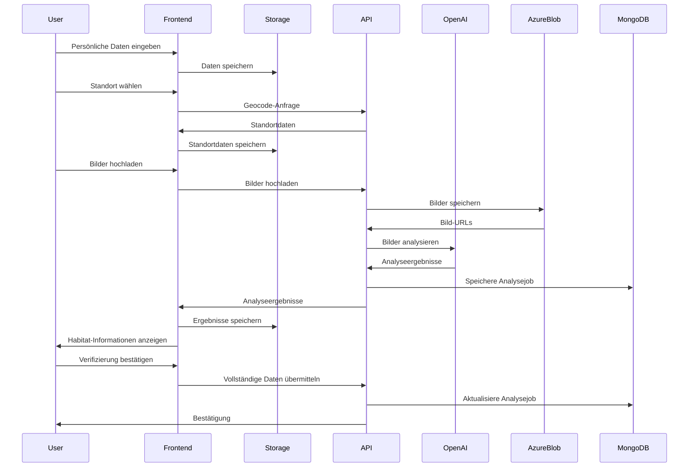

# NatureScout: Habitat-Erfassungs-Anwendung

## Übersicht

NatureScout ist eine webbasierte Anwendung zur Erfassung und KI-gestützten Analyse von Naturhabitaten in Südtirol. Die Anwendung ermöglicht es Benutzern, Standortdaten und Bilder von Naturräumen zu erfassen, die anschließend analysiert werden, um den Habitattyp und dessen Schutzstatus zu bestimmen.


## Zweck der Anwendung

NatureScout dient dazu:

1. Die Bürgerbeteiligung an der Erfassung von Naturräumen zu fördern
2. Einen Datenkatalog schützenswerter Habitate in Südtirol aufzubauen
3. Das Bewusstsein für die Biodiversität und den Naturschutz zu stärken
4. Wissenschaftliche Daten über die Verteilung von Habitattypen zu sammeln

## Workflow der Anwendung

Die Anwendung folgt einem 5-stufigen Prozess:

1. [**Willkommen**](./1-willkommen.md) - Einführung und Erfassung von Benutzerdaten
2. [**Standort bestimmen**](./2-standort-bestimmen.md) - Erfassung des Standorts mit interaktiver Karte
3. [**Bilder hochladen**](./3-bilder-hochladen.md) - Upload von Panorama- und Detailbildern mit Pflanzenerkennung
4. [**Habitat analysieren**](./4-habitat-analysieren.md) - KI-gestützte Analyse der Bilder und Bestimmung des Habitattyps
5. [**Verifizierung**](./5-verifizierung.md) - Abschluss und Übermittlung der Daten zur Expertenprüfung

## Technologie-Stack

Die Anwendung basiert auf folgenden Technologien:

- **Frontend**:
  - Next.js 14 (App Router)
  - React mit TypeScript
  - Tailwind CSS für das Styling
  - Shadcn/UI für UI-Komponenten
  - Leaflet für interaktive Karten

- **Backend**:
  - Next.js API-Routen
  - OpenAI API für die KI-gestützte Bildanalyse
  - PlantNet API für die Pflanzenerkennung
  - Node.js für serverseitige Verarbeitung
  - MongoDB für die Datenspeicherung

- **Infrastruktur**:
  - Vercel für Hosting und Deployment
  - MongoDB Atlas für die Datenbank
  - Azure Blob Storage für Bildspeicherung
  - Optionale E-Mail-Integration

## Architektur

### Komponenten-Struktur

Die Anwendung folgt einer modularen Struktur mit klarer Trennung von Zuständigkeiten:

```
src/
  app/                           # Next.js App Router
    page.tsx                     # Willkommen-Seite (Einstiegspunkt)
    standort/                    # Standort-Bestimmung
    bilder-hochladen/            # Bild-Upload
    habitat-analysieren/         # Analyse-Seite
    verifizierung/               # Abschluss-Seite
    api/                         # API-Routen
      analyze/                   # Analyse-Endpoints
      geocode/                   # Geocoding-Endpoints
      upload-images/             # Bild-Upload-Endpoints
      identify-plant/            # Pflanzenerkennungs-Endpoints
      submissions/               # Einreichungs-Endpoints
      send-confirmation-email/   # E-Mail-Versand-Endpoints
  components/                    # Geteilte UI-Komponenten
  lib/                           # Geteilte Hilfsfunktionen
    services/                    # Service-Module
      openai-service.ts          # OpenAI-Integration
      habitat-service.ts         # Habitat-Verwaltung
      analysis-service.ts        # Verwaltung der Analyseaufträge
      analysis-config-service.ts # Konfigurationen für die Analyse
    storage-utils.ts             # Speicher-Hilfsfunktionen
    api-client.ts                # API-Client-Funktionen
  types/                         # TypeScript-Typdefinitionen
    nature-scout.ts              # Hauptdatentypen der Anwendung
  styles/                        # Globale Styles
```

Eine detaillierte Beschreibung der Drei-Schichten-Architektur (Frontend, Logic-Layer, Data-Layer), der Datenspeicherung und der generischen Objekte finden Sie in der [Datenhaltungs-Dokumentation](./6-datenhaltung.md).

### Datenfluss

Der allgemeine Datenfluss in der Anwendung:

1. **Datenerfassung**: Benutzer gibt stufenweise Daten ein (Persönliche Infos → Standort → Bilder)
2. **Zwischenspeicherung**: Daten werden im Local Storage oder Session Storage zwischengespeichert
3. **Bildanalyse**: Bilder werden an die OpenAI API gesendet, um Habitate zu erkennen
4. **Ergebnisanzeige**: Erkannte Habitate und Schutzstatus werden dem Benutzer angezeigt
5. **Datenübermittlung**: Bei Abschluss werden alle Daten zur weiteren Verarbeitung gespeichert



## Abhängigkeiten

Die Hauptabhängigkeiten der Anwendung:

- **OpenAI Vision API**: Für die KI-gestützte Bildanalyse und Habitaterkennung
- **PlantNet API**: Für die Erkennung von Pflanzenarten in Detailbildern
- **Leaflet**: Für die Darstellung interaktiver Karten und Geocoding
- **Nominatim API**: Für die Umwandlung von Koordinaten in Adressinformationen
- **@azure/storage-blob**: Azure SDK für Blob Storage

## Konfiguration

Die Anwendung wird über Umgebungsvariablen konfiguriert:

```
# API-Schlüssel
OPENAI_API_KEY=sk-...
PLANTNET_API_KEY=...

# Konfiguration
HABITAT_TEST_IMAGES_PATH=...
NEXT_PUBLIC_BASE_URL=http://localhost:3000

# Azure Blob Storage
AZURE_STORAGE_CONNECTION_STRING=DefaultEndpointsProtocol=https;AccountName=ragtempproject;...
AZURE_STORAGE_CONTAINER_NAME=biodiv
UPLOAD_DIR=naturescout

# Datenbank
MONGODB_URI=mongodb+srv://...
MONGODB_DB_NAME=naturescout
MONGODB_COLLECTION_NAME=analyseJobs
```

## Entwicklung und Bereitstellung

### Entwicklung

```bash
# Repository klonen
git clone https://github.com/your-org/naturescout.git
cd naturescout

# Abhängigkeiten installieren
npm install

# Entwicklungsserver starten
npm run dev
```

### Bereitstellung

```bash
# Build erstellen
npm run build

# Starten des Produktionsservers
npm start
```

## Dokumentation

Detaillierte Dokumentation zu jedem Schritt des Workflows:

1. [Willkommen](./1-willkommen.md)
2. [Standort bestimmen](./2-standort-bestimmen.md)
3. [Bilder hochladen](./3-bilder-hochladen.md)
4. [Habitat analysieren](./4-habitat-analysieren.md)
5. [Verifizierung](./5-verifizierung.md)

Technische Dokumentation:

6. [Datenhaltung und Architektur](./6-datenhaltung.md)
7. [Test-Integration](./tests-integration.md) 