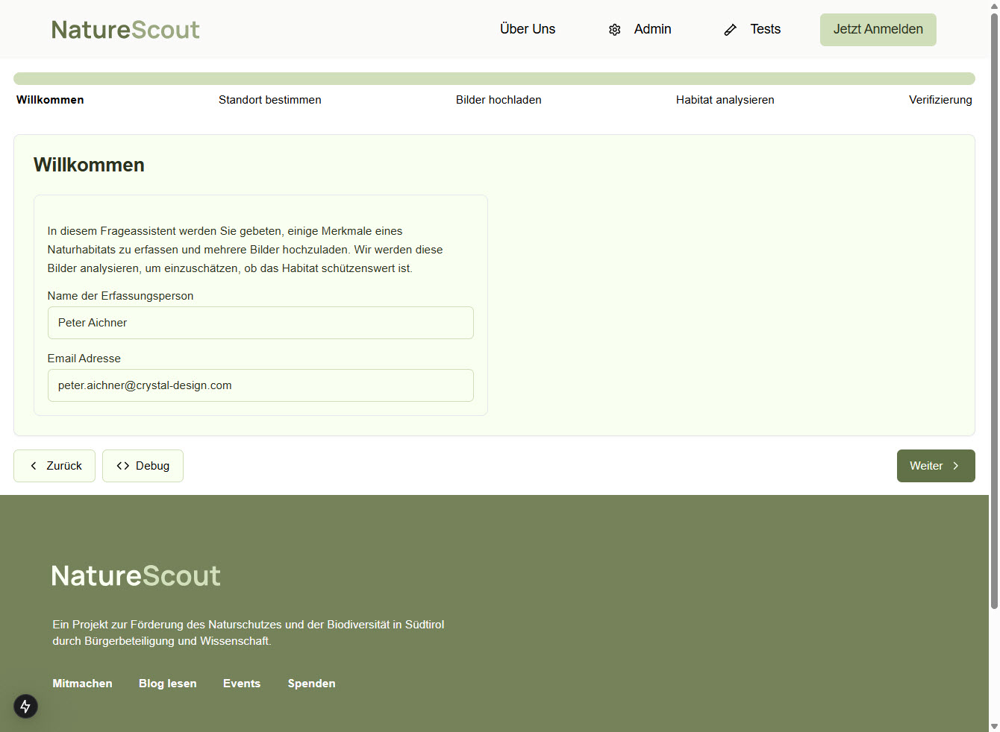

# Willkommen-Seite

## Funktionsübersicht

Die Willkommen-Seite ist der Einstiegspunkt der NatureScout-Anwendung. Sie dient dazu:

- Benutzer in die Anwendung einzuführen
- Grundlegende Benutzerinformationen zu erfassen
- Den Assistenten-Workflow zu starten



## UI-Komponenten

1. **Header-Bereich**
   - NatureScout-Logo (links)
   - Navigation (Über Uns, Admin, Tests)
   - Anmelde-Button (rechts)

2. **Fortschrittsleiste**
   - Visualisiert den 5-stufigen Prozess
   - Aktueller Schritt "Willkommen" ist aktiv

3. **Einführungstext**
   - Erklärt den Zweck des Assistenten
   - Beschreibt den Ablauf der Habitaterfassung

4. **Eingabefelder**
   - Name der Erfassungsperson
   - E-Mail-Adresse

5. **Steuerungsleiste**
   - Debug-Button (für Entwickler)
   - Weiter-Button

6. **Footer**
   - Projektbeschreibung
   - Links zu weiteren Informationen (Mitmachen, Blog, Events, Spenden)
   - Copyright-Informationen und Datenschutzhinweise

## Technische Implementierung

### Komponenten-Struktur

```
src/
  app/
    page.tsx                   # Hauptkomponente der Willkommen-Seite
    components/
      header.tsx               # Header-Komponente mit Logo und Navigation
      progress-bar.tsx         # Fortschrittsleiste
      welcome-form.tsx         # Formular für persönliche Daten
      footer.tsx               # Footer-Komponente
```

### Haupt-Komponente

`page.tsx` ist die Einstiegsseite der Anwendung und implementiert:

```typescript
// Serverkomponente als Einstiegspunkt
export default function WelcomePage() {
  return (
    <div>
      <Header />
      <ProgressBar activeStep="welcome" />
      <WelcomeForm />
      <Footer />
    </div>
  );
}
```

### Formular-Komponente

`welcome-form.tsx` implementiert die Erfassung der Benutzerinformationen:

```typescript
'use client';

// Client-Komponente für interaktive Elemente
export function WelcomeForm() {
  const router = useRouter();
  const [formState, setFormState] = useState({
    name: '',
    email: ''
  });

  // Formular-Handler für Eingabeänderungen
  const handleInputChange = (e) => {
    setFormState({
      ...formState,
      [e.target.name]: e.target.value
    });
  };

  // Formular absenden und zur nächsten Seite navigieren
  const handleSubmit = (e) => {
    e.preventDefault();
    // Speichere Daten in Session Storage oder Context
    sessionStorage.setItem('userData', JSON.stringify(formState));
    // Navigiere zur Standort-Seite
    router.push('/standort');
  };

  return (
    <form onSubmit={handleSubmit}>
      {/* Formularfelder hier */}
    </form>
  );
}
```

### Zustandsmanagement

Für die erfassten Daten wird ein kombinierter Ansatz verwendet:

1. **Temporärer Zustand**: `useState` in der Client-Komponente
2. **Persistenter Zustand**: 
   - SessionStorage für die Dauer der Sitzung
   - Alternativ: React Context Provider für app-weiten Zustand

```typescript
// In einem übergeordneten Provider
export const UserDataProvider = ({ children }) => {
  const [userData, setUserData] = useState({
    name: '',
    email: '',
    // weitere Felder ergänzen
  });

  return (
    <UserDataContext.Provider value={{ userData, setUserData }}>
      {children}
    </UserDataContext.Provider>
  );
};
```

### Datenfluss

1. Benutzer gibt seine Daten in das Formular ein
2. Client-seitiger State wird aktualisiert (useState)
3. Bei Klick auf "Weiter":
   - Daten werden validiert
   - Daten werden in SessionStorage oder Context gespeichert
   - Router navigiert zur nächsten Seite (/standort)

### API-Integration

- Keine direkte API-Anfrage in diesem Schritt
- Daten werden zunächst nur clientseitig gespeichert
- Vollständige Daten werden erst am Ende des Workflows an die API gesendet

## Konfiguration und Umgebungsvariablen

Für die Willkommen-Seite sind folgende Umgebungsvariablen relevant:

- `NEXT_PUBLIC_APP_NAME`: Name der Anwendung (Default: "NatureScout")
- `NEXT_PUBLIC_APP_VERSION`: Aktuelle Version der Anwendung

## Fehlerbehandlung

- Formularvalidierung erfolgt client-seitig
- Fehlermeldungen werden inline angezeigt
- Pflichtfelder sind mit entsprechenden Markierungen versehen 