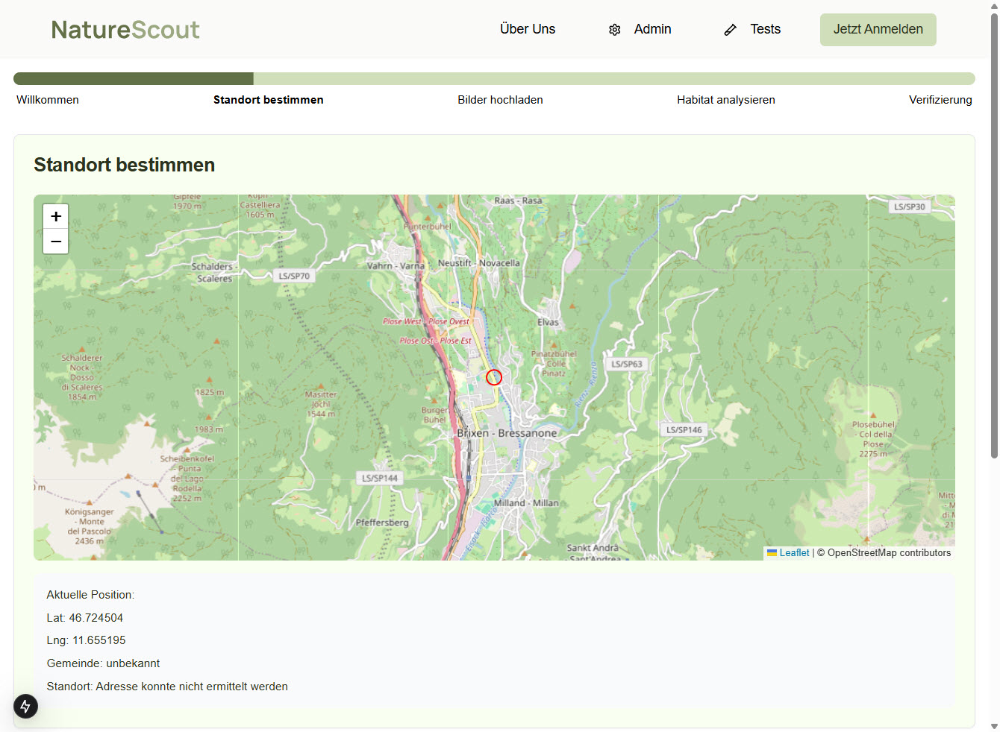

# Standort-Bestimmung

## Funktionsübersicht

Die Standortbestimmungs-Seite ermöglicht es Benutzern, den genauen Ort ihres Habitats zu bestimmen. Sie bietet:

- Interaktive Karte zur Auswahl des Standorts
- Automatische Erfassung der GPS-Koordinaten
- Anzeige und Bearbeitung der Standortinformationen
- Geocoding für Adress- und Gemeindeinformationen



## UI-Komponenten

1. **Header-Bereich**
   - NatureScout-Logo
   - Navigation
   - Anmelde-Button

2. **Fortschrittsleiste**
   - Aktueller Schritt "Standort bestimmen" ist hervorgehoben

3. **Interaktive Karte**
   - OpenStreetMap-basierte Kartenansicht
   - Markierung des ausgewählten Standorts (roter Punkt)
   - Zoom-Steuerelemente (+/-)

4. **Standortinformationen**
   - Anzeige der Koordinaten (Latitude/Longitude)
   - Gemeindename (wenn verfügbar)
   - Adressinformationen (wenn verfügbar)

5. **Steuerungsleiste**
   - Zurück-Button (zum Willkommen-Schritt)
   - Debug-Button
   - Weiter-Button (zu Bilder hochladen)

## Technische Implementierung

### Komponenten-Struktur

```
src/
  app/
    standort/
      page.tsx                   # Hauptkomponente der Standort-Seite
      components/
        location-map.tsx         # Interaktive Karte
        coordinates-display.tsx  # Anzeige der Koordinaten
        geolocation-button.tsx   # Button für aktuelle Position
```

### Haupt-Komponente

`standort/page.tsx` organisiert die Standortbestimmung:

```typescript
'use client';

import { useCallback, useEffect, useState } from 'react';
import { useRouter } from 'next/navigation';
import { LocationMap } from './components/location-map';
import { CoordinatesDisplay } from './components/coordinates-display';
import { getUserDataFromStorage, updateUserDataInStorage } from '@/lib/storage-utils';

// Initialer Standort (z.B. Zentrum von Südtirol)
const DEFAULT_COORDINATES = {
  latitude: 46.49067,
  longitude: 11.33982
};

export default function LocationPage() {
  const router = useRouter();
  const [coordinates, setCoordinates] = useState(DEFAULT_COORDINATES);
  const [locationInfo, setLocationInfo] = useState({
    gemeinde: 'unbekannt',
    adresse: 'Adresse konnte nicht ermittelt werden'
  });

  // Beim Laden versuche, aktuelle Position zu ermitteln
  useEffect(() => {
    if (navigator.geolocation) {
      navigator.geolocation.getCurrentPosition(
        (position) => {
          setCoordinates({
            latitude: position.coords.latitude,
            longitude: position.coords.longitude
          });
        },
        (error) => {
          console.error('Fehler bei der Standortbestimmung:', error);
        }
      );
    }
  }, []);

  // Aktualisiere Position bei Karteninteraktion
  const handlePositionChange = useCallback(async (lat: number, lng: number) => {
    setCoordinates({ latitude: lat, longitude: lng });
    
    // Geocoding-Service aufrufen
    try {
      const response = await fetch(`/api/geocode?lat=${lat}&lng=${lng}`);
      const data = await response.json();
      
      setLocationInfo({
        gemeinde: data.gemeinde || 'unbekannt',
        adresse: data.adresse || 'Adresse konnte nicht ermittelt werden'
      });
    } catch (error) {
      console.error('Fehler beim Geocoding:', error);
    }
  }, []);

  // Zur nächsten Seite navigieren und Daten speichern
  const handleNextStep = () => {
    const userData = getUserDataFromStorage();
    updateUserDataInStorage({
      ...userData,
      coordinates,
      locationInfo
    });
    router.push('/bilder-hochladen');
  };

  // Zur vorherigen Seite zurückkehren
  const handlePreviousStep = () => {
    router.push('/');
  };

  return (
    <div className="container">
      <h1>Standort bestimmen</h1>
      
      <LocationMap 
        coordinates={coordinates}
        onPositionChange={handlePositionChange}
      />
      
      <CoordinatesDisplay 
        latitude={coordinates.latitude}
        longitude={coordinates.longitude}
        gemeinde={locationInfo.gemeinde}
        adresse={locationInfo.adresse}
      />
      
      <div className="button-group">
        <button onClick={handlePreviousStep}>Zurück</button>
        <button onClick={handleNextStep}>Weiter</button>
      </div>
    </div>
  );
}
```

### Karten-Komponente

`location-map.tsx` implementiert die interaktive Karte:

```typescript
'use client';

import { useEffect, useRef } from 'react';
import L from 'leaflet';
import 'leaflet/dist/leaflet.css';

interface LocationMapProps {
  coordinates: { latitude: number; longitude: number };
  onPositionChange: (lat: number, lng: number) => void;
}

export function LocationMap({ coordinates, onPositionChange }: LocationMapProps) {
  const mapRef = useRef<L.Map | null>(null);
  const markerRef = useRef<L.Marker | null>(null);

  // Initialisiere Karte beim ersten Rendern
  useEffect(() => {
    if (!mapRef.current) {
      // Karte erstellen
      mapRef.current = L.map('map').setView(
        [coordinates.latitude, coordinates.longitude], 
        13
      );

      // Kartenkacheln hinzufügen
      L.tileLayer('https://{s}.tile.openstreetmap.org/{z}/{x}/{y}.png', {
        attribution: '© OpenStreetMap contributors'
      }).addTo(mapRef.current);

      // Marker hinzufügen
      markerRef.current = L.marker(
        [coordinates.latitude, coordinates.longitude],
        { draggable: true }
      ).addTo(mapRef.current);

      // Event-Handler für Marker-Bewegung
      markerRef.current.on('dragend', () => {
        const position = markerRef.current?.getLatLng();
        if (position) {
          onPositionChange(position.lat, position.lng);
        }
      });

      // Event-Handler für Klick auf Karte
      mapRef.current.on('click', (e) => {
        const { lat, lng } = e.latlng;
        markerRef.current?.setLatLng([lat, lng]);
        onPositionChange(lat, lng);
      });
    }
  }, []);

  // Aktualisiere Marker-Position wenn Koordinaten sich ändern
  useEffect(() => {
    if (mapRef.current && markerRef.current) {
      markerRef.current.setLatLng([
        coordinates.latitude,
        coordinates.longitude
      ]);
      
      mapRef.current.setView([
        coordinates.latitude,
        coordinates.longitude
      ]);
    }
  }, [coordinates]);

  return (
    <div id="map" style={{ height: '500px', width: '100%' }}></div>
  );
}
```

### API-Integration

#### Geocoding-API

`/api/geocode/route.ts` für die Umwandlung von Koordinaten in Adressangaben:

```typescript
import { NextResponse } from 'next/server';

export async function GET(request: Request) {
  const { searchParams } = new URL(request.url);
  const lat = searchParams.get('lat');
  const lng = searchParams.get('lng');

  if (!lat || !lng) {
    return NextResponse.json(
      { error: 'Latitude und Longitude müssen angegeben werden' },
      { status: 400 }
    );
  }

  try {
    // Externe Geocoding-API verwenden (z.B. Nominatim)
    const response = await fetch(
      `https://nominatim.openstreetmap.org/reverse?lat=${lat}&lon=${lng}&format=json`
    );
    
    const data = await response.json();
    
    // Extrahiere relevante Informationen
    const result = {
      gemeinde: data.address?.city || data.address?.town || data.address?.village || 'unbekannt',
      adresse: data.display_name || 'Adresse konnte nicht ermittelt werden'
    };
    
    return NextResponse.json(result);
  } catch (error) {
    console.error('Geocoding-Fehler:', error);
    return NextResponse.json(
      { error: 'Fehler beim Geocoding' },
      { status: 500 }
    );
  }
}
```

### Datenfluss

1. Benutzer öffnet die Seite:
   - Initialisierung der Karte mit Standardkoordinaten
   - Versuch, die aktuelle Position zu ermitteln (mit Benutzererlaubnis)

2. Interaktion mit der Karte:
   - Benutzer verschiebt den Marker oder klickt auf die Karte
   - Koordinaten werden aktualisiert
   - Geocoding-API wird aufgerufen
   - Standortinformationen werden angezeigt

3. Weiter-Button:
   - Speichern der Positionsdaten im SessionStorage/Context
   - Navigation zur Bilder-Upload-Seite

### Abhängigkeiten

- **Leaflet**: JavaScript-Bibliothek für interaktive Karten
- **Nominatim**: OpenStreetMap-Service für Geocoding
- **next/navigation**: Für die Routennavigation

## Fehlerbehandlung

- Fallback auf Standardkoordinaten, wenn Geolokalisierung fehlschlägt
- Nutzerfreundliche Fehleranzeige bei Problemen mit dem Geocoding
- Robuste Validierung der Koordinaten vor dem Speichern

## Leistungsoptimierung

- Verzögertes Laden der Karte (Lazy Loading)
- Debouncing für Geocoding-Aufrufe bei Drag-Events
- Zwischenspeicherung von Geocoding-Ergebnissen für häufig verwendete Koordinaten 