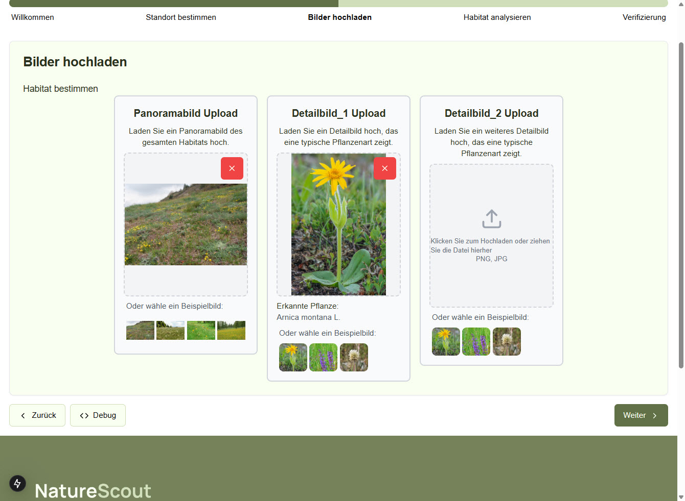

# Bilder hochladen

## Funktionsübersicht

Die Bilder-Upload-Seite ermöglicht es Benutzern, Fotos ihres Habitats hochzuladen. Sie bietet:

- Upload eines Panoramabilds für die Gesamtansicht des Habitats
- Upload von Detailbildern für charakteristische Pflanzen
- Automatische Pflanzenerkennung mit PlantNet-Integration
- Vorschaubilder und Beispielbilder für eine leichtere Orientierung



## UI-Komponenten

1. **Header-Bereich**
   - NatureScout-Logo
   - Navigation
   - Anmelde-Button

2. **Fortschrittsleiste**
   - Aktueller Schritt "Bilder hochladen" ist hervorgehoben

3. **Upload-Bereiche**
   - Panoramabild-Upload mit Beschreibung
   - Detailbild 1 Upload mit Beschreibung
   - Detailbild 2 Upload mit Beschreibung (optional)

4. **Jeder Upload-Bereich enthält**:
   - Beschreibungstext
   - Drop-Zone für Datei-Upload
   - Vorschau des hochgeladenen Bildes
   - Löschen-Button für hochgeladene Bilder
   - Beispielbilder zur Orientierung

5. **Pflanzen-Erkennung (für Detailbilder)**
   - Anzeige erkannter Pflanzen
   - Konfidenzwert der Erkennung

6. **Steuerungsleiste**
   - Zurück-Button (zur Standort-Seite)
   - Debug-Button
   - Weiter-Button (zur Habitat-Analyse)

## Technische Implementierung

### Komponenten-Struktur

```
src/
  app/
    bilder-hochladen/
      page.tsx                    # Hauptkomponente der Bilder-Upload-Seite
      components/
        panorama-upload.tsx       # Panoramabild-Upload-Komponente
        detail-upload.tsx         # Detailbild-Upload-Komponente
        example-images.tsx        # Beispielbilder-Komponente
        plant-recognition.tsx     # Komponente für Pflanzenerkennung
```

### Haupt-Komponente

`bilder-hochladen/page.tsx` organisiert den Bild-Upload:

```typescript
'use client';

import { useState, useEffect } from 'react';
import { useRouter } from 'next/navigation';
import { PanoramaUpload } from './components/panorama-upload';
import { DetailUpload } from './components/detail-upload';
import { getUserDataFromStorage, updateUserDataInStorage } from '@/lib/storage-utils';

interface UploadedImage {
  file: File;
  preview: string;
  plantRecognition?: {
    species: string;
    confidence: number;
  };
}

export default function BilderUploadPage() {
  const router = useRouter();
  const [panoramaImage, setPanoramaImage] = useState<UploadedImage | null>(null);
  const [detailImage1, setDetailImage1] = useState<UploadedImage | null>(null);
  const [detailImage2, setDetailImage2] = useState<UploadedImage | null>(null);
  const [isUploading, setIsUploading] = useState(false);

  // Laden gespeicherter Bilder (falls Benutzer zurückkehrt)
  useEffect(() => {
    const userData = getUserDataFromStorage();
    
    // Lade Bildvorschauen, falls vorhanden
    if (userData.imageData) {
      if (userData.imageData.panoramaPreview) {
        setPanoramaImage({
          file: null,
          preview: userData.imageData.panoramaPreview
        });
      }
      
      if (userData.imageData.detailPreview1) {
        setDetailImage1({
          file: null,
          preview: userData.imageData.detailPreview1,
          plantRecognition: userData.imageData.plantRecognition1
        });
      }
      
      if (userData.imageData.detailPreview2) {
        setDetailImage2({
          file: null,
          preview: userData.imageData.detailPreview2,
          plantRecognition: userData.imageData.plantRecognition2
        });
      }
    }
  }, []);

  // Für Panoramabild
  const handlePanoramaUpload = (file: File) => {
    const reader = new FileReader();
    reader.onload = () => {
      setPanoramaImage({
        file,
        preview: reader.result as string
      });
    };
    reader.readAsDataURL(file);
  };

  // Für Detailbild 1
  const handleDetailUpload1 = async (file: File) => {
    const reader = new FileReader();
    reader.onload = () => {
      const preview = reader.result as string;
      
      // Pflanzenerkennung starten
      identifyPlant(file, preview).then(plantData => {
        setDetailImage1({
          file,
          preview,
          plantRecognition: plantData
        });
      });
    };
    reader.readAsDataURL(file);
  };

  // Für Detailbild 2
  const handleDetailUpload2 = async (file: File) => {
    const reader = new FileReader();
    reader.onload = () => {
      const preview = reader.result as string;
      
      // Pflanzenerkennung starten
      identifyPlant(file, preview).then(plantData => {
        setDetailImage2({
          file,
          preview,
          plantRecognition: plantData
        });
      });
    };
    reader.readAsDataURL(file);
  };

  // PlantNet-API für Pflanzenerkennung
  const identifyPlant = async (file: File, preview: string) => {
    try {
      const formData = new FormData();
      formData.append('image', file);
      
      const response = await fetch('/api/identify-plant', {
        method: 'POST',
        body: formData
      });
      
      const data = await response.json();
      
      if (data.results && data.results.length > 0) {
        return {
          species: data.results[0].species.scientificName,
          confidence: data.results[0].score * 100
        };
      }
      
      return null;
    } catch (error) {
      console.error('Fehler bei der Pflanzenerkennung:', error);
      return null;
    }
  };

  // Bilder löschen
  const handleRemovePanorama = () => setPanoramaImage(null);
  const handleRemoveDetail1 = () => setDetailImage1(null);
  const handleRemoveDetail2 = () => setDetailImage2(null);

  // Zur nächsten Seite navigieren und Daten speichern
  const handleNextStep = async () => {
    if (!panoramaImage || !detailImage1) {
      alert('Bitte laden Sie mindestens ein Panoramabild und ein Detailbild hoch.');
      return;
    }
    
    setIsUploading(true);
    
    try {
      // Bereite Daten für Speicherung vor
      const userData = getUserDataFromStorage();
      
      // Update Bilder-Vorschauen im Storage
      updateUserDataInStorage({
        ...userData,
        imageData: {
          panoramaPreview: panoramaImage.preview,
          detailPreview1: detailImage1.preview,
          detailPreview2: detailImage2?.preview,
          plantRecognition1: detailImage1.plantRecognition,
          plantRecognition2: detailImage2?.plantRecognition
        }
      });
      
      // Upload der eigentlichen Bilder zum Server
      if (panoramaImage.file || detailImage1.file || (detailImage2 && detailImage2.file)) {
        const formData = new FormData();
        
        if (panoramaImage.file) {
          formData.append('panorama', panoramaImage.file);
        }
        
        if (detailImage1.file) {
          formData.append('detail1', detailImage1.file);
        }
        
        if (detailImage2 && detailImage2.file) {
          formData.append('detail2', detailImage2.file);
        }
        
        // Koordinaten hinzufügen
        formData.append('metadata', JSON.stringify({
          coordinates: userData.coordinates,
          location: userData.locationInfo,
          user: {
            name: userData.name,
            email: userData.email
          }
        }));
        
        const response = await fetch('/api/upload-images', {
          method: 'POST',
          body: formData
        });
        
        if (!response.ok) {
          throw new Error('Fehler beim Upload der Bilder');
        }
        
        const data = await response.json();
        
        // Speichere die Bild-IDs für später
        updateUserDataInStorage({
          ...userData,
          imageData: {
            ...userData.imageData,
            uploadedImageIds: data.imageIds
          }
        });
      }
      
      // Weiter zur Analyse-Seite
      router.push('/habitat-analysieren');
    } catch (error) {
      console.error('Upload-Fehler:', error);
      alert('Es gab ein Problem beim Hochladen der Bilder. Bitte versuchen Sie es erneut.');
    } finally {
      setIsUploading(false);
    }
  };

  // Zur vorherigen Seite zurückkehren
  const handlePreviousStep = () => {
    router.push('/standort');
  };

  return (
    <div className="container">
      <h1>Bilder hochladen</h1>
      <p>Habitat bestimmen</p>
      
      <div className="upload-grid">
        <PanoramaUpload
          image={panoramaImage}
          onUpload={handlePanoramaUpload}
          onRemove={handleRemovePanorama}
        />
        
        <DetailUpload
          title="Detailbild_1 Upload"
          description="Laden Sie ein Detailbild hoch, das eine typische Pflanzenart zeigt."
          image={detailImage1}
          onUpload={handleDetailUpload1}
          onRemove={handleRemoveDetail1}
          plantRecognition={detailImage1?.plantRecognition}
        />
        
        <DetailUpload
          title="Detailbild_2 Upload"
          description="Laden Sie ein weiteres Detailbild hoch, das eine typische Pflanzenart zeigt."
          image={detailImage2}
          onUpload={handleDetailUpload2}
          onRemove={handleRemoveDetail2}
          plantRecognition={detailImage2?.plantRecognition}
          isOptional
        />
      </div>
      
      <div className="button-group">
        <button onClick={handlePreviousStep} disabled={isUploading}>Zurück</button>
        <button onClick={handleNextStep} disabled={isUploading || !panoramaImage || !detailImage1}>
          {isUploading ? 'Wird hochgeladen...' : 'Weiter'}
        </button>
      </div>
    </div>
  );
}
```

### Upload-Komponente

`detail-upload.tsx` implementiert den Detailbild-Upload:

```typescript
'use client';

import { useCallback } from 'react';
import Image from 'next/image';
import { useDropzone } from 'react-dropzone';

interface DetailUploadProps {
  title: string;
  description: string;
  image: { preview: string } | null;
  onUpload: (file: File) => void;
  onRemove: () => void;
  plantRecognition?: {
    species: string;
    confidence: number;
  };
  isOptional?: boolean;
}

export function DetailUpload({
  title,
  description,
  image,
  onUpload,
  onRemove,
  plantRecognition,
  isOptional = false
}: DetailUploadProps) {
  // Dropzone für Datei-Upload
  const onDrop = useCallback((acceptedFiles: File[]) => {
    if (acceptedFiles.length > 0) {
      onUpload(acceptedFiles[0]);
    }
  }, [onUpload]);

  const { getRootProps, getInputProps, isDragActive } = useDropzone({
    onDrop,
    accept: {
      'image/jpeg': ['.jpg', '.jpeg'],
      'image/png': ['.png']
    },
    maxFiles: 1,
    maxSize: 10 * 1024 * 1024 // 10MB
  });

  // Beispielbilder
  const exampleImages = [
    '/examples/detail1.jpg',
    '/examples/detail2.jpg',
    '/examples/detail3.jpg'
  ];

  return (
    <div className="upload-container">
      <h2>{title}</h2>
      <p>{description}</p>
      
      {!image ? (
        <div 
          {...getRootProps()} 
          className={`dropzone ${isDragActive ? 'active' : ''}`}
        >
          <input {...getInputProps()} />
          
          <div className="upload-placeholder">
            <svg /* Upload-Icon SVG */ />
            <p>
              Klicken Sie zum Hochladen oder ziehen Sie die Datei hierher
              <br />
              <span className="file-type">PNG, JPG</span>
            </p>
          </div>
        </div>
      ) : (
        <div className="image-preview">
          <Image
            src={image.preview}
            alt="Vorschau"
            width={300}
            height={200}
            objectFit="cover"
          />
          
          <button className="remove-button" onClick={onRemove}>
            ×
          </button>
          
          {plantRecognition && (
            <div className="plant-info">
              <p>Erkannte Pflanze:</p>
              <p className="plant-name">{plantRecognition.species}</p>
              <div className="confidence-bar">
                <div 
                  className="confidence-fill" 
                  style={{ width: `${plantRecognition.confidence}%` }}
                />
              </div>
              <p className="confidence-value">{plantRecognition.confidence.toFixed(0)}%</p>
            </div>
          )}
        </div>
      )}
      
      <div className="example-section">
        <p>Oder wähle ein Beispielbild:</p>
        <div className="example-images">
          {exampleImages.map((src, index) => (
            <div 
              key={index}
              className="example-image"
              onClick={() => {
                // Simuliere Upload mit Beispielbild
                fetch(src)
                  .then(res => res.blob())
                  .then(blob => {
                    const file = new File([blob], `example-${index}.jpg`, { type: 'image/jpeg' });
                    onUpload(file);
                  });
              }}
            >
              <Image
                src={src}
                alt={`Beispiel ${index + 1}`}
                width={80}
                height={80}
                objectFit="cover"
              />
            </div>
          ))}
        </div>
      </div>
    </div>
  );
}
```

### API-Integration

#### Pflanzenerkennungs-API

`/api/identify-plant/route.ts` für die Integration mit PlantNet:

```typescript
import { NextResponse } from 'next/server';
import { promises as fs } from 'fs';
import path from 'path';
import { v4 as uuidv4 } from 'uuid';

// Temporäres Verzeichnis für Uploads
const TEMP_DIR = path.join(process.cwd(), 'tmp');

export async function POST(request: Request) {
  try {
    // Stelle sicher, dass das temporäre Verzeichnis existiert
    await fs.mkdir(TEMP_DIR, { recursive: true });
    
    const formData = await request.formData();
    const imageFile = formData.get('image') as File;
    
    if (!imageFile) {
      return NextResponse.json({ error: 'Kein Bild gefunden' }, { status: 400 });
    }
    
    const bytes = await imageFile.arrayBuffer();
    const buffer = Buffer.from(bytes);
    
    // Temporärer Dateiname erstellen
    const tempFilePath = path.join(TEMP_DIR, `${uuidv4()}-${imageFile.name}`);
    await fs.writeFile(tempFilePath, buffer);
    
    // PlantNet API aufrufen
    const apiKey = process.env.PLANTNET_API_KEY;
    const formDataAPI = new FormData();
    
    // Lies die Datei wieder ein für den Upload
    const fileBuffer = await fs.readFile(tempFilePath);
    const fileBlob = new Blob([fileBuffer]);
    formDataAPI.append('images', fileBlob as any, imageFile.name);
    
    // PlantNet API-Aufruf
    const plantNetResponse = await fetch(
      `https://my-api.plantnet.org/v2/identify/all?api-key=${apiKey}`,
      {
        method: 'POST',
        body: formDataAPI
      }
    );
    
    // Lösche die temporäre Datei
    await fs.unlink(tempFilePath);
    
    if (!plantNetResponse.ok) {
      return NextResponse.json(
        { error: 'Fehler bei der Pflanzenerkennung' },
        { status: 500 }
      );
    }
    
    const plantNetData = await plantNetResponse.json();
    return NextResponse.json(plantNetData);
  } catch (error) {
    console.error('Fehler bei der Pflanzenerkennung:', error);
    return NextResponse.json(
      { error: 'Server-Fehler bei der Verarbeitung des Bildes' },
      { status: 500 }
    );
  }
}
```

#### Bild-Upload-API

`/api/upload-images/route.ts` für den eigentlichen Bild-Upload:

```typescript
import { NextResponse } from 'next/server';
import { promises as fs } from 'fs';
import path from 'path';
import { v4 as uuidv4 } from 'uuid';

// Verzeichnis für hochgeladene Bilder
const UPLOAD_DIR = path.join(process.cwd(), 'public/uploads');

export async function POST(request: Request) {
  try {
    // Stelle sicher, dass das Upload-Verzeichnis existiert
    await fs.mkdir(UPLOAD_DIR, { recursive: true });
    
    const formData = await request.formData();
    const metadataJson = formData.get('metadata') as string;
    const metadata = JSON.parse(metadataJson);
    
    const imageIds = {
      panoramaId: '',
      detail1Id: '',
      detail2Id: ''
    };
    
    // Verarbeite Panoramabild
    const panoramaFile = formData.get('panorama') as File;
    if (panoramaFile) {
      const panoramaId = uuidv4();
      const fileExtension = path.extname(panoramaFile.name);
      const panoramaFileName = `${panoramaId}${fileExtension}`;
      const panoramaPath = path.join(UPLOAD_DIR, panoramaFileName);
      
      const bytes = await panoramaFile.arrayBuffer();
      await fs.writeFile(panoramaPath, Buffer.from(bytes));
      
      imageIds.panoramaId = panoramaId;
    }
    
    // Verarbeite Detailbild 1
    const detail1File = formData.get('detail1') as File;
    if (detail1File) {
      const detail1Id = uuidv4();
      const fileExtension = path.extname(detail1File.name);
      const detail1FileName = `${detail1Id}${fileExtension}`;
      const detail1Path = path.join(UPLOAD_DIR, detail1FileName);
      
      const bytes = await detail1File.arrayBuffer();
      await fs.writeFile(detail1Path, Buffer.from(bytes));
      
      imageIds.detail1Id = detail1Id;
    }
    
    // Verarbeite Detailbild 2 (optional)
    const detail2File = formData.get('detail2') as File;
    if (detail2File) {
      const detail2Id = uuidv4();
      const fileExtension = path.extname(detail2File.name);
      const detail2FileName = `${detail2Id}${fileExtension}`;
      const detail2Path = path.join(UPLOAD_DIR, detail2FileName);
      
      const bytes = await detail2File.arrayBuffer();
      await fs.writeFile(detail2Path, Buffer.from(bytes));
      
      imageIds.detail2Id = detail2Id;
    }
    
    // Speichere Metadaten und Bild-IDs in der Datenbank
    // (Vereinfacht für diese Dokumentation)
    const analysisId = uuidv4();
    
    // In einer realen Implementierung würde hier eine Datenbankoperation stattfinden
    // await db.collection('analyses').insertOne({
    //   id: analysisId,
    //   imageIds,
    //   metadata,
    //   timestamp: new Date()
    // });
    
    return NextResponse.json({
      success: true,
      analysisId,
      imageIds
    });
  } catch (error) {
    console.error('Fehler beim Hochladen:', error);
    return NextResponse.json(
      { error: 'Server-Fehler beim Hochladen der Bilder' },
      { status: 500 }
    );
  }
}
```

### Datenfluss

1. Benutzer öffnet die Seite:
   - Vorhandene Bild-Vorschauen werden aus dem lokalen Speicher geladen
   - Upload-Bereiche werden initialisiert

2. Bild-Upload:
   - Benutzer zieht ein Bild in die Drop-Zone oder klickt zum Auswählen
   - Bild wird als Vorschau angezeigt
   - Bei Detailbildern wird die Pflanzenerkennung gestartet
   - Erkannte Pflanze wird mit Konfidenzwert angezeigt

3. Beispielbilder:
   - Benutzer kann Beispielbilder auswählen
   - Diese werden wie normale Uploads behandelt

4. Weiter-Button:
   - Validierung (mindestens Panorama und ein Detailbild)
   - Bilder werden zum Server hochgeladen
   - Metadaten werden mit den Bildern verknüpft
   - Navigation zur Analyse-Seite

### Abhängigkeiten

- **react-dropzone**: Für Drag-and-Drop-Datei-Uploads
- **PlantNet API**: Externe API für Pflanzenerkennung
- **uuid**: Für eindeutige Bildkennungen

## Fehlerbehandlung

- Validierung von Bildtypen (.jpg, .png) und Größe (max. 10MB)
- Fehlerbehandlung bei fehlgeschlagenen Uploads
- Nutzerfreundliche Fehleranzeigen
- Robuste Wiederherstellung bei Rückkehr zur Seite

## Leistungsoptimierung

- Vorschau-Generierung im Browser für sofortiges Feedback
- Komprimierung von Bildern vor dem Upload
- Parallele Verarbeitung von Bildern
- Lazy Loading für Beispielbilder 