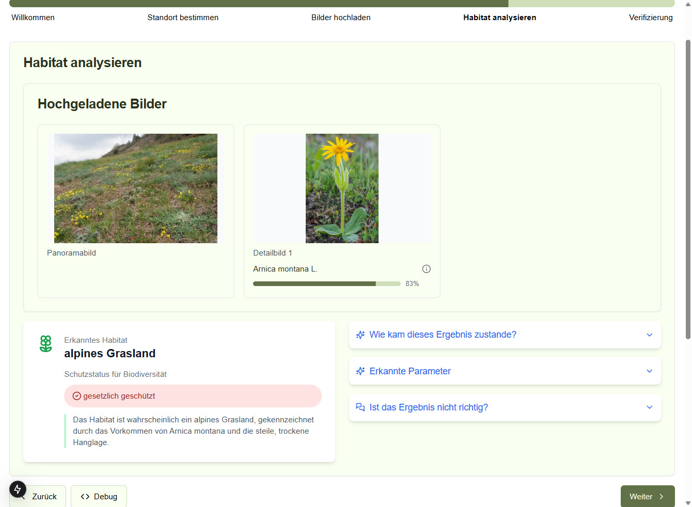

# Habitat analysieren

## Funktionsübersicht

Die Habitat-Analyse-Seite präsentiert die KI-basierte Auswertung der hochgeladenen Bilder. Sie bietet:

- Anzeige der hochgeladenen Bilder
- Ergebnisse der Pflanzenbestimmung mit Konfidenzwerten
- Erkannten Habitattyp mit detaillierter Beschreibung
- Schutzstatus für Biodiversität
- Möglichkeit, weitere Informationen zu den Ergebnissen anzuzeigen
- Option, die Ergebnisse zu korrigieren



## UI-Komponenten

1. **Header-Bereich**
   - NatureScout-Logo
   - Navigation
   - Anmelde-Button

2. **Fortschrittsleiste**
   - Aktueller Schritt "Habitat analysieren" ist hervorgehoben

3. **Bilder-Ansicht**
   - Anzeige des Panoramabilds
   - Anzeige der Detailbilder mit erkannten Pflanzen
   - Konfidenzwerte für die Pflanzenerkennung

4. **Ergebnis-Bereich**
   - Erkanntes Habitat mit Bezeichnung
   - Schutzstatus mit grafischer Kennzeichnung
   - Beschreibung des Habitats

5. **Akkordeon-Abschnitte**
   - "Wie kam dieses Ergebnis zustande?" - Erklärung der Analyse
   - "Erkannte Parameter" - Details zu erkannten Merkmalen
   - "Ist das Ergebnis nicht richtig?" - Feedback-Optionen

6. **Steuerungsleiste**
   - Zurück-Button (zur Bilder-Upload-Seite)
   - Debug-Button
   - Weiter-Button (zur Verifizierung)

## Technische Implementierung

### Komponenten-Struktur

```
src/
  app/
    habitat-analysieren/
      page.tsx                      # Hauptkomponente der Analyse-Seite
      components/
        uploaded-images.tsx         # Anzeige der hochgeladenen Bilder
        habitat-result.tsx          # Anzeige des erkannten Habitats
        accordion-panels.tsx        # Erklärungen und Parameter-Anzeige
        protection-status.tsx       # Anzeige des Schutzstatus
        analysis-progress.tsx       # Fortschrittsanzeige während der Analyse
```

### Haupt-Komponente

`habitat-analysieren/page.tsx` zeigt die Analyseergebnisse:

```typescript
'use client';

import { useState, useEffect } from 'react';
import { useRouter } from 'next/navigation';
import { UploadedImages } from './components/uploaded-images';
import { HabitatResult } from './components/habitat-result';
import { AccordionPanels } from './components/accordion-panels';
import { ProtectionStatus } from './components/protection-status';
import { AnalysisProgress } from './components/analysis-progress';
import { getUserDataFromStorage, updateUserDataInStorage } from '@/lib/storage-utils';

interface AnalysisResult {
  habitattyp: string;
  beschreibung: string;
  schutzstatus: {
    status: 'gesetzlich geschützt' | 'schützenswert' | 'nicht geschützt';
    begründung: string;
  };
  erkannteParameter: {
    standort: string[];
    vegetation: string[];
    nutzungsspuren: string[];
  };
  konfidenz: number;
}

export default function HabitatAnalysePage() {
  const router = useRouter();
  const [isAnalyzing, setIsAnalyzing] = useState(false);
  const [analysisResult, setAnalysisResult] = useState<AnalysisResult | null>(null);
  const [userData, setUserData] = useState<any>(null);
  const [error, setError] = useState<string | null>(null);

  // Lade Daten und starte Analyse, wenn Seite geladen wird
  useEffect(() => {
    const storedUserData = getUserDataFromStorage();
    setUserData(storedUserData);

    // Prüfe ob bereits Analyseergebnisse vorhanden sind
    if (storedUserData.analysisResult) {
      setAnalysisResult(storedUserData.analysisResult);
    } else {
      // Starte neue Analyse
      startAnalysis(storedUserData);
    }
  }, []);

  // Starte die Analyse
  const startAnalysis = async (data) => {
    if (!data.imageData || !data.imageData.uploadedImageIds) {
      setError('Keine Bild-Daten gefunden. Bitte laden Sie Bilder hoch.');
      return;
    }

    setIsAnalyzing(true);
    
    try {
      // Analyse-API aufrufen
      const response = await fetch('/api/analyze/habitat', {
        method: 'POST',
        headers: {
          'Content-Type': 'application/json',
        },
        body: JSON.stringify({
          imageIds: data.imageData.uploadedImageIds,
          coordinates: data.coordinates,
          location: data.locationInfo,
          user: {
            name: data.name,
            email: data.email
          }
        }),
      });

      if (!response.ok) {
        throw new Error('Fehler bei der Habitat-Analyse');
      }

      const result = await response.json();
      
      // Ergebnis speichern
      setAnalysisResult(result);
      
      // Ergebnis im Storage speichern
      updateUserDataInStorage({
        ...data,
        analysisResult: result
      });
    } catch (error) {
      console.error('Analyse-Fehler:', error);
      setError('Es gab ein Problem bei der Analyse. Bitte versuchen Sie es erneut.');
    } finally {
      setIsAnalyzing(false);
    }
  };

  // Zur nächsten Seite navigieren
  const handleNextStep = () => {
    router.push('/verifizierung');
  };

  // Zur vorherigen Seite zurückkehren
  const handlePreviousStep = () => {
    router.push('/bilder-hochladen');
  };

  // Beim Feedback über falsches Ergebnis
  const handleFeedback = async (feedback) => {
    try {
      await fetch('/api/feedback', {
        method: 'POST',
        headers: {
          'Content-Type': 'application/json',
        },
        body: JSON.stringify({
          analysisId: userData.imageData.uploadedImageIds.panoramaId,
          feedback
        }),
      });
      
      alert('Vielen Dank für Ihr Feedback!');
    } catch (error) {
      console.error('Feedback-Fehler:', error);
    }
  };

  // Zeige Ladeanzeige während der Analyse
  if (isAnalyzing) {
    return <AnalysisProgress />;
  }

  // Zeige Fehlermeldung
  if (error) {
    return (
      <div className="container">
        <h1>Habitat analysieren</h1>
        <div className="error-message">
          <p>{error}</p>
          <button onClick={() => router.push('/bilder-hochladen')}>
            Zurück zu Bilder hochladen
          </button>
        </div>
      </div>
    );
  }

  // Zeige Ergebnisse
  return (
    <div className="container">
      <h1>Habitat analysieren</h1>
      
      {userData && userData.imageData && (
        <UploadedImages
          panoramaUrl={userData.imageData.panoramaPreview}
          detailUrl1={userData.imageData.detailPreview1}
          detailUrl2={userData.imageData.detailPreview2}
          plantRecognition1={userData.imageData.plantRecognition1}
          plantRecognition2={userData.imageData.plantRecognition2}
        />
      )}
      
      {analysisResult && (
        <>
          <HabitatResult
            habitat={analysisResult.habitattyp}
            description={analysisResult.beschreibung}
          />
          
          <ProtectionStatus
            status={analysisResult.schutzstatus.status}
            reason={analysisResult.schutzstatus.begründung}
          />
          
          <AccordionPanels
            parameters={analysisResult.erkannteParameter}
            confidence={analysisResult.konfidenz}
            onFeedback={handleFeedback}
          />
        </>
      )}
      
      <div className="button-group">
        <button onClick={handlePreviousStep}>Zurück</button>
        <button onClick={handleNextStep} disabled={!analysisResult}>Weiter</button>
      </div>
    </div>
  );
}
```

### Habitat-Ergebnis-Komponente

`habitat-result.tsx` zeigt das erkannte Habitat:

```typescript
import { Plant } from 'lucide-react';

interface HabitatResultProps {
  habitat: string;
  description: string;
}

export function HabitatResult({ habitat, description }: HabitatResultProps) {
  return (
    <div className="habitat-result">
      <div className="habitat-header">
        <Plant className="h-6 w-6 text-green-600" />
        <h2>Erkanntes Habitat</h2>
      </div>
      
      <div className="habitat-content">
        <h3 className="habitat-name">{habitat}</h3>
        <p className="habitat-description">{description}</p>
      </div>
    </div>
  );
}
```

### Akkordeon-Komponente

`accordion-panels.tsx` implementiert die aufklappbaren Bereiche:

```typescript
'use client';

import { useState } from 'react';
import { ChevronDown, ChevronUp, Info, List, AlertTriangle } from 'lucide-react';

interface AccordionPanelsProps {
  parameters: {
    standort: string[];
    vegetation: string[];
    nutzungsspuren: string[];
  };
  confidence: number;
  onFeedback: (feedback: any) => void;
}

export function AccordionPanels({ parameters, confidence, onFeedback }: AccordionPanelsProps) {
  const [openPanel, setOpenPanel] = useState<string | null>(null);
  const [feedbackText, setFeedbackText] = useState('');

  const togglePanel = (panelId: string) => {
    setOpenPanel(openPanel === panelId ? null : panelId);
  };

  const submitFeedback = () => {
    onFeedback({
      type: 'correction',
      text: feedbackText
    });
    setFeedbackText('');
  };

  return (
    <div className="accordion-panels">
      {/* Explanation Panel */}
      <div className="accordion-item">
        <button
          className="accordion-header"
          onClick={() => togglePanel('explanation')}
        >
          <div className="flex items-center">
            <Info className="h-5 w-5 mr-2" />
            <span>Wie kam dieses Ergebnis zustande?</span>
          </div>
          {openPanel === 'explanation' ? (
            <ChevronUp className="h-5 w-5" />
          ) : (
            <ChevronDown className="h-5 w-5" />
          )}
        </button>
        
        {openPanel === 'explanation' && (
          <div className="accordion-content">
            <p>
              Die Habitat-Erkennung basiert auf einer KI-gestützten Analyse der hochgeladenen Bilder. 
              Dabei werden folgende Faktoren berücksichtigt:
            </p>
            <ul>
              <li>Erkannte Pflanzenarten und ihre Häufigkeit</li>
              <li>Standortbedingungen wie Höhenlage, Exposition und Boden</li>
              <li>Vegetationsstruktur und Landschaftskontext</li>
              <li>Nutzungsspuren und anthropogene Einflüsse</li>
            </ul>
            <p>
              Die Analyse hat eine geschätzte Genauigkeit von {confidence.toFixed(0)}% für diesen Fall.
            </p>
          </div>
        )}
      </div>

      {/* Parameters Panel */}
      <div className="accordion-item">
        <button
          className="accordion-header"
          onClick={() => togglePanel('parameters')}
        >
          <div className="flex items-center">
            <List className="h-5 w-5 mr-2" />
            <span>Erkannte Parameter</span>
          </div>
          {openPanel === 'parameters' ? (
            <ChevronUp className="h-5 w-5" />
          ) : (
            <ChevronDown className="h-5 w-5" />
          )}
        </button>
        
        {openPanel === 'parameters' && (
          <div className="accordion-content">
            <div className="parameter-section">
              <h4>Standort</h4>
              <ul>
                {parameters.standort.map((item, index) => (
                  <li key={index}>{item}</li>
                ))}
              </ul>
            </div>
            
            <div className="parameter-section">
              <h4>Vegetation</h4>
              <ul>
                {parameters.vegetation.map((item, index) => (
                  <li key={index}>{item}</li>
                ))}
              </ul>
            </div>
            
            <div className="parameter-section">
              <h4>Nutzungsspuren</h4>
              <ul>
                {parameters.nutzungsspuren.length > 0 ? (
                  parameters.nutzungsspuren.map((item, index) => (
                    <li key={index}>{item}</li>
                  ))
                ) : (
                  <li>Keine Nutzungsspuren erkannt</li>
                )}
              </ul>
            </div>
          </div>
        )}
      </div>

      {/* Feedback Panel */}
      <div className="accordion-item">
        <button
          className="accordion-header"
          onClick={() => togglePanel('feedback')}
        >
          <div className="flex items-center">
            <AlertTriangle className="h-5 w-5 mr-2" />
            <span>Ist das Ergebnis nicht richtig?</span>
          </div>
          {openPanel === 'feedback' ? (
            <ChevronUp className="h-5 w-5" />
          ) : (
            <ChevronDown className="h-5 w-5" />
          )}
        </button>
        
        {openPanel === 'feedback' && (
          <div className="accordion-content">
            <p>
              Haben Sie eine andere Meinung oder kennen Sie das korrekte Habitat? 
              Bitte teilen Sie uns Ihre Rückmeldung mit:
            </p>
            <textarea
              className="feedback-textarea"
              placeholder="Beschreiben Sie das korrekte Habitat und nennen Sie, wenn möglich, charakteristische Pflanzenarten."
              value={feedbackText}
              onChange={(e) => setFeedbackText(e.target.value)}
              rows={4}
            />
            <button 
              className="feedback-button"
              onClick={submitFeedback}
              disabled={!feedbackText.trim()}
            >
              Rückmeldung senden
            </button>
          </div>
        )}
      </div>
    </div>
  );
}
```

### Analyse-API

`/api/analyze/habitat/route.ts` führt die Habitatanalyse durch:

```typescript
import { NextResponse } from 'next/server';
import { openai } from '@/lib/openai-client';
import { getHabitatTypes } from '@/lib/services/habitat-service';

export async function POST(request: Request) {
  try {
    const requestData = await request.json();
    const { imageIds, coordinates, location, user } = requestData;
    
    if (!imageIds || !imageIds.panoramaId || !imageIds.detail1Id) {
      return NextResponse.json(
        { error: 'Fehlende Bild-IDs' },
        { status: 400 }
      );
    }

    // Bild-URLs zusammenstellen
    const baseUrl = process.env.NEXT_PUBLIC_BASE_URL || 'http://localhost:3000';
    const imageUrls = [
      `${baseUrl}/uploads/${imageIds.panoramaId}.jpg`,
      `${baseUrl}/uploads/${imageIds.detail1Id}.jpg`
    ];
    
    if (imageIds.detail2Id) {
      imageUrls.push(`${baseUrl}/uploads/${imageIds.detail2Id}.jpg`);
    }

    // Laden aller verfügbaren Habitattypen
    const habitatTypes = await getHabitatTypes();

    // Analyse mit OpenAI durchführen
    const response = await openai.chat.completions.create({
      model: "gpt-4-vision-preview",
      messages: [
        {
          role: "system",
          content: `Du bist ein Experte für Habitaterkennung in Südtirol. Analysiere die Bilder und bestimme den Habitattyp.
          Verfügbare Habitattypen: ${habitatTypes.map(h => h.name).join(', ')}.
          Gib die Antwort als JSON-Objekt zurück mit folgenden Attributen:
          - habitattyp: Der Name des erkannten Habitats aus der Liste der verfügbaren Typen
          - beschreibung: Eine kurze Beschreibung des Habitats (max. 2 Sätze)
          - erkannteParameter: Ein Objekt mit den Attributen "standort" (Array von Strings), 
            "vegetation" (Array von Strings) und "nutzungsspuren" (Array von Strings)
          - konfidenz: Prozentualer Wert zwischen 0 und 100
          `
        },
        {
          role: "user",
          content: [
            {
              type: "text",
              text: `Standort: Latitude ${coordinates.latitude}, Longitude ${coordinates.longitude}
              Gemeinde: ${location.gemeinde}
              Bitte analysiere die folgenden Bilder und bestimme den Habitattyp.`
            },
            ...imageUrls.map(url => ({
              type: "image_url",
              image_url: { url }
            }))
          ]
        }
      ],
      max_tokens: 1000,
      temperature: 0.2,
      response_format: { type: "json_object" }
    });

    // Analyseergebnis verarbeiten
    const analysisResult = JSON.parse(response.choices[0].message.content);
    
    // Schutzstatus ermitteln
    const schutzstatusResult = await openai.chat.completions.create({
      model: "gpt-4-turbo",
      messages: [
        {
          role: "system",
          content: `Du bist ein Experte für Naturschutz in Südtirol. Bestimme den Schutzstatus des Habitats basierend auf den EU-Richtlinien und lokalen Schutzbestimmungen.`
        },
        {
          role: "user",
          content: `Bestimme den Schutzstatus für das Habitat: ${analysisResult.habitattyp}
          Mit folgenden erkannten Merkmalen: 
          - Standort: ${analysisResult.erkannteParameter.standort.join(', ')}
          - Vegetation: ${analysisResult.erkannteParameter.vegetation.join(', ')}
          - Nutzungsspuren: ${analysisResult.erkannteParameter.nutzungsspuren.join(', ') || 'keine'}
          
          Gib die Antwort als JSON-Objekt zurück mit folgenden Attributen:
          - status: Entweder "gesetzlich geschützt", "schützenswert" oder "nicht geschützt"
          - begründung: Eine kurze Begründung für den Status`
        }
      ],
      max_tokens: 500,
      temperature: 0.2,
      response_format: { type: "json_object" }
    });

    const schutzstatus = JSON.parse(schutzstatusResult.choices[0].message.content);
    
    // Vollständiges Ergebnis zurückgeben
    const fullResult = {
      ...analysisResult,
      schutzstatus
    };

    // Speichere das Analyseergebnis in der Datenbank
    // (Vereinfacht für diese Dokumentation)
    // await db.collection('analyseResults').insertOne({
    //   userId: user.email,
    //   imageIds,
    //   coordinates,
    //   location,
    //   result: fullResult,
    //   timestamp: new Date()
    // });

    return NextResponse.json(fullResult);
  } catch (error) {
    console.error('Habitat-Analyse-Fehler:', error);
    return NextResponse.json(
      { error: 'Fehler bei der Habitat-Analyse' },
      { status: 500 }
    );
  }
}
```

### Datenfluss

1. Benutzer öffnet die Seite:
   - Vorhandene Bilder werden aus dem SessionStorage/Context geladen
   - Wenn noch keine Analyse durchgeführt wurde, wird die Analyse gestartet

2. Analyseprozess:
   - Bilder und Metadaten werden an die Analyse-API gesendet
   - OpenAI Vision-Modell analysiert die Bilder
   - Habitattyp, Parameter und Konfidenz werden ermittelt
   - Schutzstatus wird basierend auf dem erkannten Habitat bestimmt
   - Ergebnisse werden zurückgegeben und im State und Storage gespeichert

3. Ergebnisanzeige:
   - Erkannter Habitattyp mit Beschreibung wird angezeigt
   - Schutzstatus wird mit visueller Kennzeichnung dargestellt
   - Akkordeon-Panels ermöglichen Zugriff auf detaillierte Informationen

4. Benutzerinteraktion:
   - Benutzer kann Erklärungen zur Analyse einsehen
   - Benutzer kann erkannte Parameter überprüfen
   - Benutzer kann Feedback geben, wenn das Ergebnis nicht korrekt erscheint

5. Weiter-Button:
   - Speichern der Analyseergebnisse im SessionStorage/Context
   - Navigation zur Verifizierungs-Seite

### Abhängigkeiten

- **OpenAI API**: Für die KI-gestützte Bildanalyse und Habitaterkennung
- **Lucide React**: Für Icons und visuelle Elemente
- **Habitat-Service**: Interne Bibliothek für die Verwaltung von Habitattypen

## Fehlerbehandlung

- Fehlerbehandlung bei fehlenden Bildern
- Benutzerfreundliche Anzeige bei Analyse-Fehlern
- Wiederherstellungsmechanismen für unterbrochene Analysen

## Leistungsoptimierung

- Zwischenspeichern von Analyseergebnissen für wiederholte Besuche
- Optimiertes Bild-Loading für schnellere Anzeige
- Progressive Offenlegung von Informationen durch Akkordeon-Struktur 