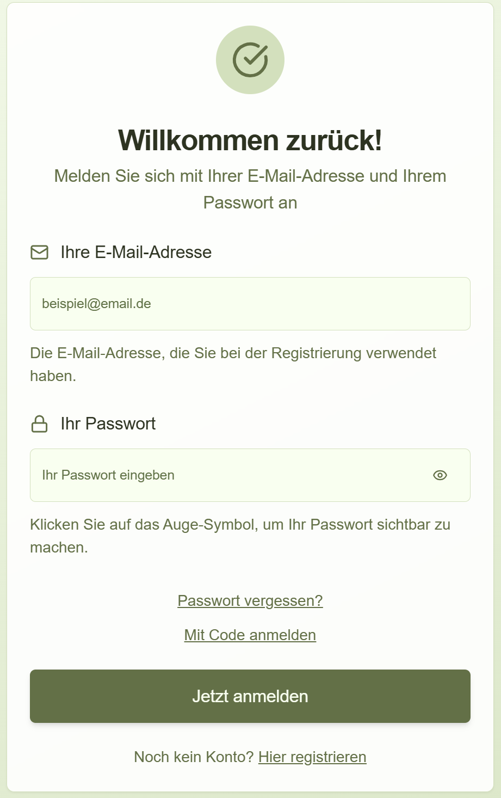

# Anmelden & Profil

## Anmeldung (Überblick)

Es gibt aktuell drei einfache Wege:

- **Mit Passwort anmelden** (E‑Mail + Passwort)
- **Passwort vergessen** (Link per E‑Mail → neues Passwort setzen)
- **Mit Code anmelden** (6‑stelliger Code per E‑Mail)

> Hinweis: Wenn Sie sich nicht sicher sind, welchen Weg Sie brauchen:
> Starten Sie mit **„Mit Passwort anmelden“**. Wenn es nicht klappt, nutzen Sie **„Passwort vergessen“** oder **„Mit Code anmelden“**.

## Weg 1: Mit Passwort anmelden

1. Öffnen Sie **„Anmelden“**.
2. Geben Sie Ihre **E‑Mail‑Adresse** ein.
3. Geben Sie Ihr **Passwort** ein.
4. Klicken Sie auf **„Jetzt anmelden“**.

  

### Falls das Passwort „plötzlich“ nicht mehr funktioniert

In seltenen Fällen kann es vorkommen, dass alte Passwörter nach einer System‑Aktualisierung nicht mehr akzeptiert werden.
Dann wählen Sie **„Passwort vergessen?“** und setzen ein neues Passwort.

## Weg 2: Passwort vergessen (Passwort zurücksetzen)

1. Auf der Anmeldeseite **„Passwort vergessen?“** wählen.
2. Ihre **E‑Mail‑Adresse** eingeben.
3. **„Passwort‑Link senden“** klicken.
4. Postfach öffnen und den Link anklicken.
5. Ein neues Passwort setzen (**mindestens 8 Zeichen**).

Wichtig:

- Der Link ist **nur kurze Zeit gültig** (Richtwert: 1 Stunde).
- Aus Datenschutzgründen steht auf der Seite oft: „Falls diese E‑Mail-Adresse registriert ist …“.
- Falls keine E‑Mail kommt: **Spam‑Ordner** prüfen und ein paar Minuten warten.

## Weg 3: Mit Code anmelden (ohne Passwort)

Das ist hilfreich, wenn Sie Ihr Passwort nicht griffbereit haben, aber Zugriff auf Ihr E‑Mail‑Postfach.

1. Auf der Anmeldeseite **„Mit Code anmelden“** wählen.
2. Ihre **E‑Mail‑Adresse** eingeben.
3. **„Code anfordern“** klicken.
4. Sie erhalten einen **6‑stelligen Code** per E‑Mail.
5. Code eingeben und **„Jetzt anmelden“** klicken.

Wichtig:

- Der Code ist **zeitlich begrenzt gültig** (Richtwert: 15 Minuten).
- Wenn Sie keinen Code bekommen: Spam‑Ordner prüfen.
- Zu viele Anfragen in kurzer Zeit werden gebremst (Richtwert: **max. 3 Codes in 5 Minuten**).

## Registrierung (wenn Sie noch kein Konto haben)

1. Auf der Anmeldeseite **„Hier registrieren“** wählen.
2. Name und E‑Mail eingeben.
3. Passwort wählen (**mindestens 8 Zeichen**) und bestätigen.
4. Nutzungsbedingungen akzeptieren.
5. Registrierung abschließen und danach anmelden.

## Einladung (optional)

Wenn Sie einen Einladungslink erhalten (z.B. von einer Organisation), folgen Sie dem Link.
Je nach Status kann es sein, dass Sie beim ersten Login zuerst ein Passwort **erstellen** müssen.

  

## Profil einrichten

1. Tragen Sie Ihren **vollständigen Namen** ein (Pflichtfeld).
2. Optional: Laden Sie ein **Profilbild** hoch.
3. Klicken Sie auf **„Speichern“**.

## Organisationszugehörigkeit

In der Startabfrage können Sie:

- eine bestehende **Organisation auswählen**, oder
- über **„Neue Organisation anlegen“** einen neuen Eintrag erstellen.

Zusätzlich können Sie einstellen, **wie Ihr Name bei Ihren erfassten Habitaten angezeigt wird**:

- **öffentlich**: Ihr Name ist auch für anonyme Besucher*innen sichtbar („wer hat das Habitat erfasst?“).
- **nur für Mitglieder**: Ihr Name ist nur für Mitglieder **derselben Organisation** sichtbar.
- **anonym**: Ihr Name wird nicht angezeigt. Es wird nur die **Organisation** angezeigt.

## Passwort (nur bei E‑Mail/Passwort)

1. Klicken Sie auf Ihr Profilbild und wählen Sie **„Kontoeinstellungen“**.
2. Unter **„Sicherheit“** → **„Passwort ändern“** ein neues Passwort setzen.
3. Falls nötig: **„Passwort vergessen?“** auf der Anmeldeseite starten.

## Tipp (Mobilgerät)

Viele Nutzer*innen öffnen NatureScout lieber wie eine App:
Im Browser-Menü **„Zum Startbildschirm hinzufügen“** wählen.

## Hinweis zu E-Mails (bitte kurz Geduld)

Bei **Passwort-Link** und **Anmelde-Code** gilt:

- Manchmal kommt die E-Mail erst nach **1–5 Minuten**.
- Bitte auch den **Spam-/Junk-Ordner** prüfen.
- Wenn dort etwas liegt: „NatureScout“ als **vertrauenswürdig** markieren, damit es nächstes Mal im Posteingang landet.

