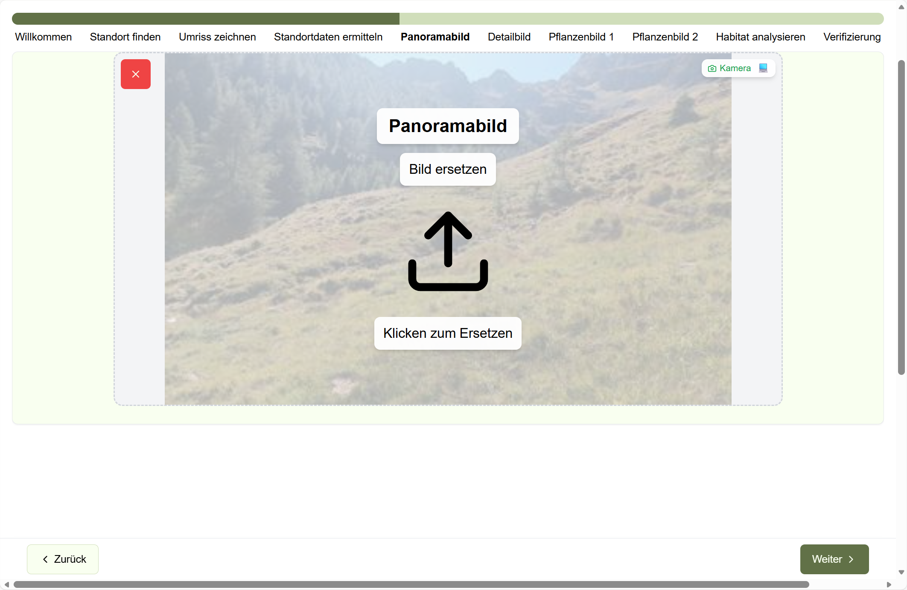
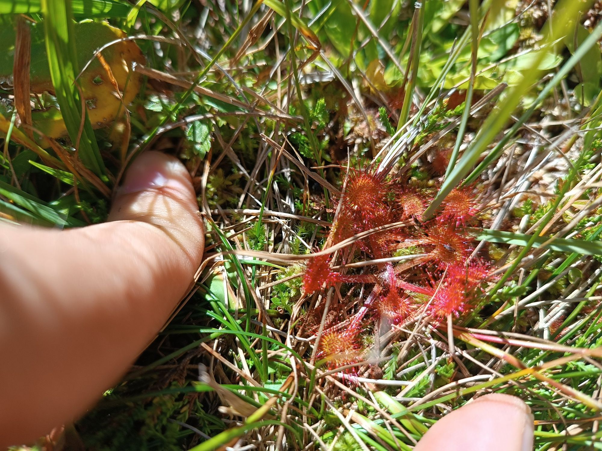

# Bilder (Phase) – Schritte „Panoramabild“, „Detailbild“, „Pflanzenbild 1“, „Pflanzenbild 2“

Fotos sind die wichtigste Grundlage für die Auswertung.
Bitte nehmen Sie sich dafür kurz Zeit – das verbessert die Ergebnisse deutlich.

Dieses Kapitel deckt im Assistenten diese Schritte ab:

- **Panoramabild**
- **Detailbild**
- **Pflanzenbild 1**
- **Pflanzenbild 2** (optional)

## Welche Bilder werden benötigt?

- **Panorama (Pflicht)**: Gesamtübersicht des Habitats.
  - Ideal: Horizont sichtbar, typische Struktur gut erkennbar.
- **Detailbild (Pflicht)**: typische Habitat-Detailansicht (z.B. Boden/Bestand).
- **Pflanzenbild 1 (Pflicht)**: eine typische Pflanze aus kurzer Distanz (pro Bild genau eine Pflanze).
- **Pflanzenbild 2 (optional)**: eine weitere typische Pflanze (andere Art als Pflanzenbild 1 ist ideal).

## Beispiele (kleine Vorschau)

  

    
    
<strong>Panorama</strong> (Pflicht)

  

  

    
    
<strong>Detail</strong> (Pflicht)

  

  

    
    
<strong>Pflanze 1</strong> (Pflicht)

  

  

    
    
<strong>Pflanze 2</strong> (optional)

  

## So gehen Sie vor

1. Laden Sie zuerst das **Panoramabild** hoch.
2. Laden Sie danach das **Detailbild** hoch.
3. Laden Sie anschließend **Pflanzenbild 1** hoch.
4. Optional: Laden Sie **Pflanzenbild 2** hoch (wenn Sie eine zweite typische Art gut fotografieren können).
5. Prüfen Sie kurz die Vorschau.
6. Klicken Sie auf **„Weiter“** – die Analyse startet.

## Tipps für bessere Fotos

- Halten Sie das Handy möglichst ruhig (kurz ausatmen hilft).
- Vermeiden Sie starke Gegenlicht‑Situationen.
- Bei Pflanzenbildern: Blatt/Blüte möglichst scharf und bildfüllend.

## Achtung

- Wenn ein Upload nicht klappt: Bildgröße prüfen (Richtwert: **unter 10 MB**), dann erneut versuchen.
- Wenn ein Bild schief ist: (je nach Gerät) vor dem Hochladen kurz drehen/korrigieren.

