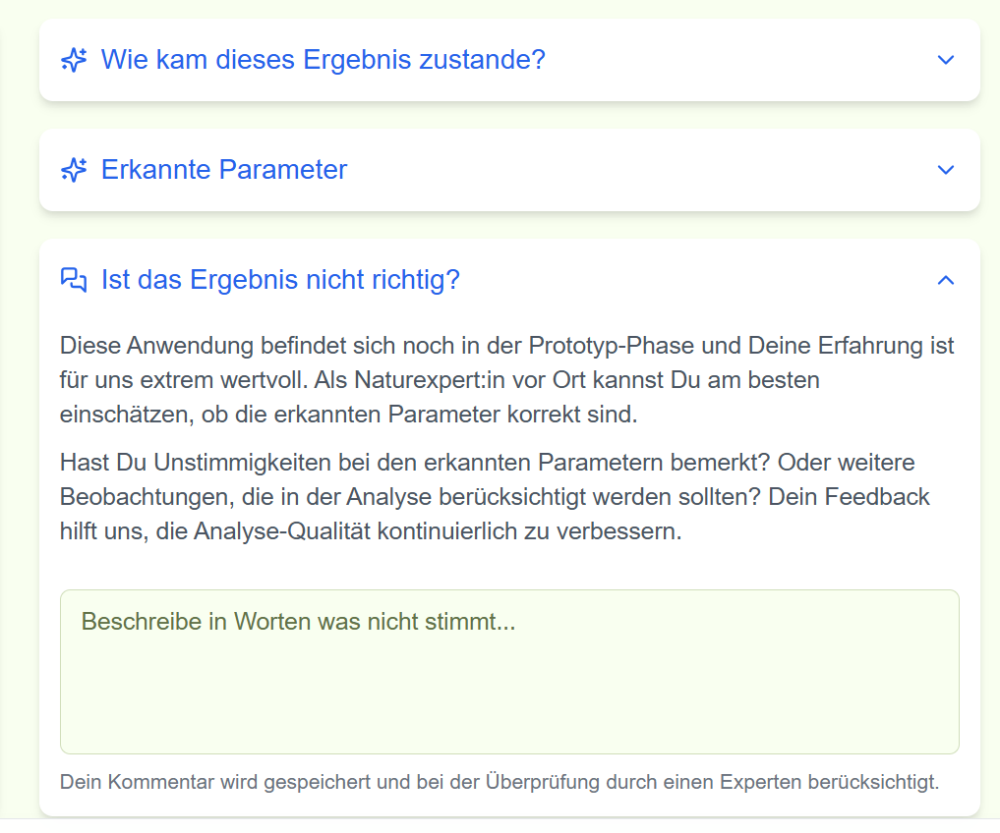

# Analysephase (Schritt „Habitat analysieren“)

Nach dem Hochladen wertet NatureScout die Bilder aus und zeigt ein Ergebnis an.
Das dauert meist nur kurz.

## Was Sie sehen

- Ein **vorgeschlagener Habitattyp**
- Oft auch zusätzliche Informationen, z.B. **erkannte Merkmale/Parameter**
- Bei Detailbildern: ggf. erkannte Pflanzen (mit einer Einschätzung)

## So gehen Sie vor

1. Warten Sie, bis das Ergebnis angezeigt wird.
2. Prüfen Sie, ob der vorgeschlagene Habitattyp **plausibel** ist.
3. Wenn etwas nicht stimmt:
   - öffnen Sie **„Ist das Ergebnis nicht richtig?“**
   - schreiben Sie kurz, was Ihrer Meinung nach besser passt (1–2 Sätze reichen).
4. Klicken Sie auf **„Weiter“**.

## Hinweis: Wo gebe ich eine Rückmeldung ein?

Wenn Sie auf **„Ist das Ergebnis nicht richtig?“** klicken, öffnet sich ein Bereich mit einem Textfeld.
Dort können Sie kurz beschreiben, was nicht stimmt.

  

## Tipp (gute Rückmeldungen)

Hilfreich sind kurze Hinweise wie:

- „Fettwiese, aber eher mager ausgeprägt; dichter Bestand.“
- „Mehr Gehölzaufwuchs als im Ergebnis; Übergangsbereich.“

