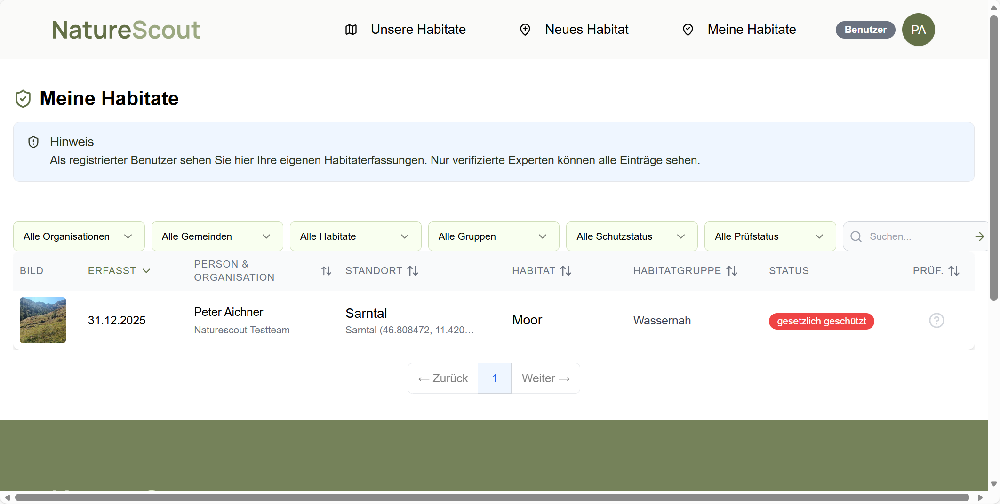

# Meine Habitate (Nachverfolgung)

Hier sehen Sie Ihre eigenen Erfassungen und deren Status.

## Öffentlich vs. privat (kurz)

- **Meine Habitate**: Ihre persönliche Übersicht (auch ungeprüfte Einträge).
- **Unsere Habitate**: öffentliche Übersicht – dort erscheinen in der Regel **nur verifizierte** Einträge.
  (siehe auch: [Unsere Habitate (öffentlich)](04-unsere-habitate.md))

## So finden Sie Ihre Einträge

1. Loggen Sie sich ein.
2. Öffnen Sie **„Meine Habitate“**.
3. Klicken Sie auf einen Eintrag, um Details zu sehen.

## Status (typische Bedeutungen)

- **Ungeprüft**: wartet auf die Prüfung durch Expert*innen.
- **Verifiziert**: geprüft und bestätigt.
- **Abgelehnt**: nicht als valides Habitat eingestuft (z.B. unklar, nicht passend).

## Tipp

Wenn Sie später bessere Fotos haben:
Lieber eine neue Erfassung anlegen, statt die alte „zu retten“.

