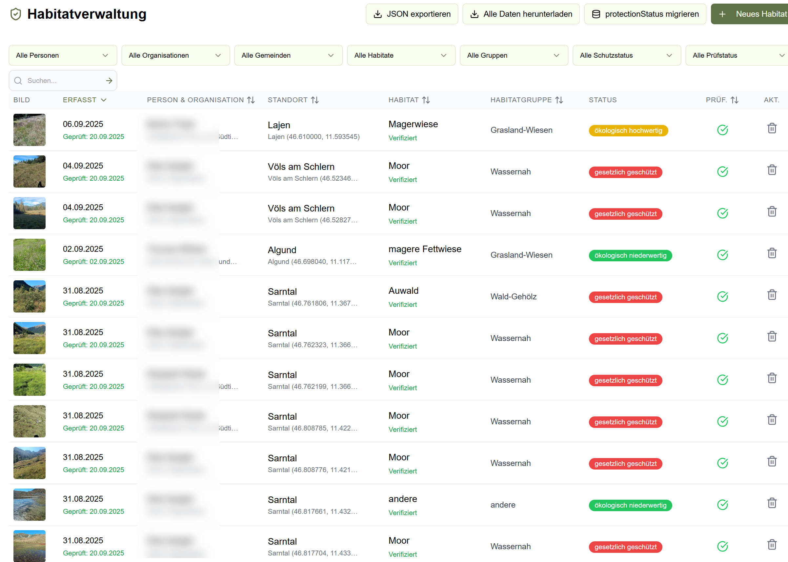

# Habitate verwalten (Expert*innen)

Als Expert*in können Sie alle Erfassungen sehen, filtern und prüfen.

## Übersicht

In der Habitatverwaltung sehen Sie typischerweise eine Tabelle mit:

- Datum der Erfassung
- Erfassende Person
- Gemeinde / Gebiet
- (Vorgeschlagener) Habitattyp
- Prüfstatus

## Filtern & Suchen

Nutzen Sie Filter, um schneller zu finden, was Sie brauchen, z.B.:

- Person (Erfasser*in)
- Organisation
- Gemeinde
- Habitattyp / Habitatfamilie
- Schutzstatus
- Prüfstatus

> Tipp: Aktive Filter werden oft als kleine „Badges“ angezeigt und lassen sich einzeln entfernen.

## Prüfung durchführen

1. Öffnen Sie einen ungeprüften Eintrag.
2. Prüfen Sie Bilder und Analyse.
3. Bestätigen oder korrigieren Sie den Habitattyp.
4. Speichern / Verifizieren (je nach Oberfläche).

