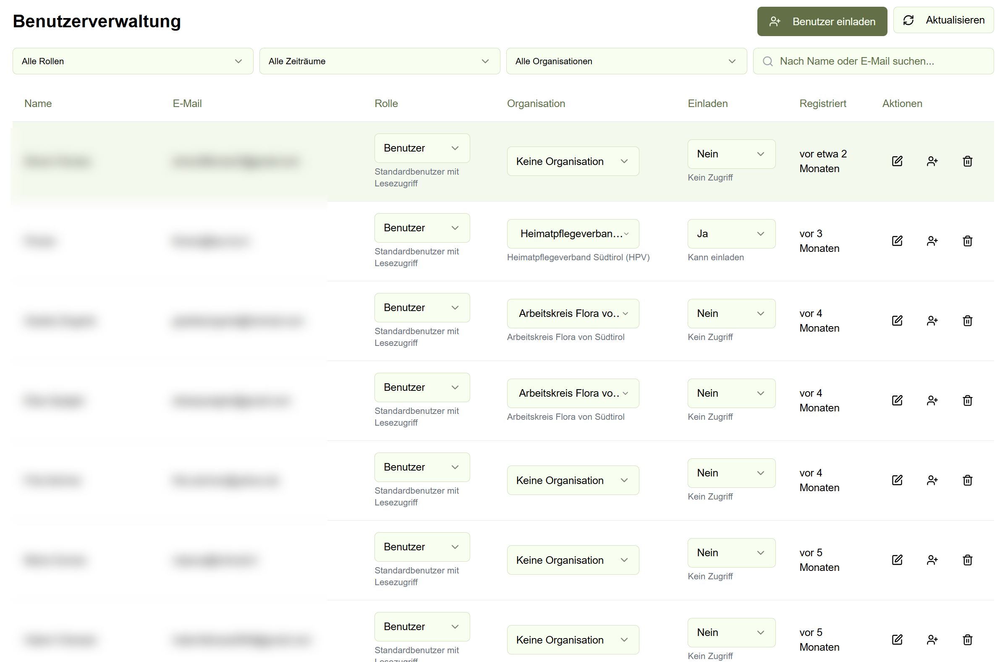
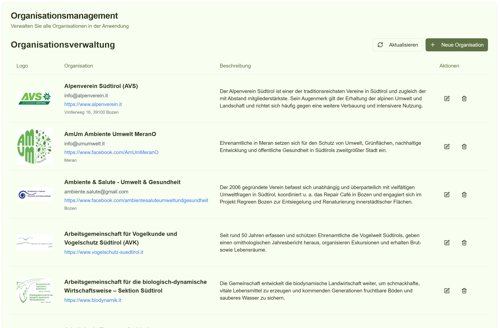

# Anwendung administrieren (Admin)

Dieser Bereich ist für Administrator*innen gedacht.

Die Administration besteht in der Praxis aus drei Bereichen:

- **Benutzerverwaltung** (Rollen, Organisation, Einladungen)
- **Organisationsverwaltung** (Organisationen anlegen/bearbeiten)
- **Habitat‑Typen** (Habitatgruppen, Schutzstatus, Beschreibungen)

## Benutzerverwaltung

Hier verwalten Sie Benutzer*innen und deren Rechte.

  

Typische Aufgaben (kurz):

- Benutzer*innen suchen und filtern (Rolle, Organisation, Datum)
- Rolle vergeben/anpassen (z.B. Benutzer / Expert*in / Admin)
- Organisation zuweisen/ändern
- Einladungen senden (falls aktiviert)
- Benutzer*innen deaktivieren/löschen (mit Vorsicht)

## Organisationsverwaltung

Hier verwalten Sie Organisationen, die in NatureScout genutzt werden.

  

Typische Aufgaben (kurz):

- Organisationen anlegen
- Namen/Logo/Beschreibung bearbeiten
- Sichtbarkeit/Anzeige prüfen (wie Organisationen und Erfassungen angezeigt werden)
- Dubletten zusammenführen (falls Prozess vorhanden)

## Habitat‑Typen verwalten

Hier pflegen Sie Habitat‑Typen, Gruppen und deren Schutzstatus/Infos.

  

Typische Aufgaben (kurz):

- Habitat‑Typen anlegen/bearbeiten
- Habitat‑Gruppe zuordnen
- Schutzstatus prüfen/setzen
- Beschreibung und typische Arten ergänzen

## Hinweis

Bitte beachten: Es sollte immer mindestens eine Person mit Admin-Rechten im System bleiben.

